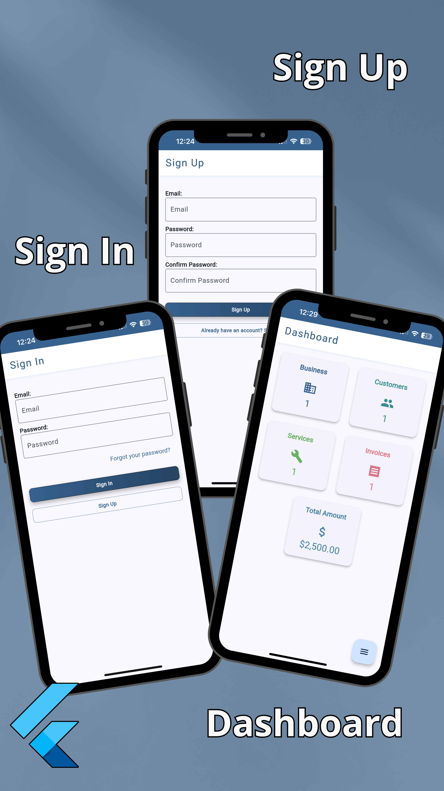
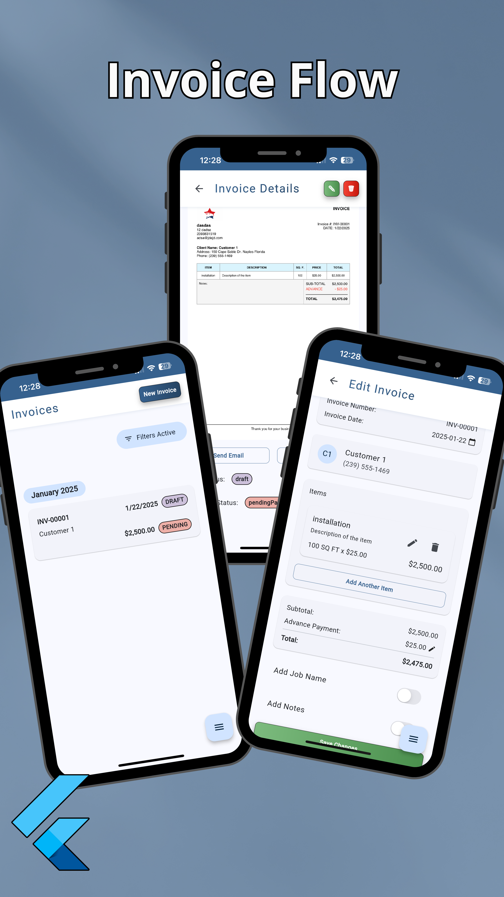

# Business Invoice Generator App

A web and mobile app for generating and managing business invoices, built with Flutter and Firebase.

<div align="center">
  
  
  
</div>

## 🌐 Live Demo

Try the app at: [business-invoice-generator.web.app](https://business-invoice-generator.web.app)

## ✨ Main Features

### 📊 Business Management
- Customizable business profile
- Corporate logo and branding
- Business contact information and details
- Brand color customization

### 👥 Customer Management
- Customer database
- Detailed customer profiles
- Invoice history per customer
- Contact information management

### 💼 Service Management
- Customizable service catalog
- Prices and descriptions
- Service categorization
- Metrics per service

### 📄 Invoice Generation
- Automatic invoice number generation
- Professional and customizable design
- Automatic calculations
- Multiple export formats
- Payment status and tracking

### 📱 Multiplatform Features
- Responsive design
- Real-time synchronization
- Access from any device
- Adaptive interface

## 📂 Project Architecture
- Features-First

### Folder Structure
```
lib/
└── src/
    ├── app/
    ├── core/
    ├── features/
    │   ├── auth/
    │   ├── business/
    │   ├── customer/
    │   ├── invoice/
    │   ├── pdf/
    │   └── service/
    ├── localization/
    └── routing/
```

### Application Layers

#### 🎯 Domain
- Business models
- Repository interfaces
- Business rules
- Validations

#### 📊 Data
- Repository implementations
- Firebase services
- State management
- Local storage

#### 🖼 Presentation
- Widgets and pages
- Controllers
- State management with Riverpod
- Navigation

## 🔒 Security

- Authentication with Firebase Auth
- Security rules in Firestore
- Real-time data validation
- Sensitive data encryption
- Automatic backups

## 🛠 Technologies Used

- Flutter 3.27.3
- Firebase (Auth, Firestore, Storage)
- Riverpod for state management
- PDF for document generation
- Go Router for navigation
- Freezed for immutable models

## 📱 Supported Platforms

- Web (PWA)
- Android
- iOS
- Windows (in development)
- macOS (in development)
- Linux (in development)

## 🚀 Getting Started

1. Clone the repository:
```bash
git clone https://github.com/tu-usuario/business_invoice_generator.git
```

2. Install the dependencies:
```bash
flutter pub get
```

3. Configure Firebase:
- Create a project in Firebase Console
- Add the necessary configurations for each platform
- Update the configuration files

4. Run the application:
```bash
flutter run
```